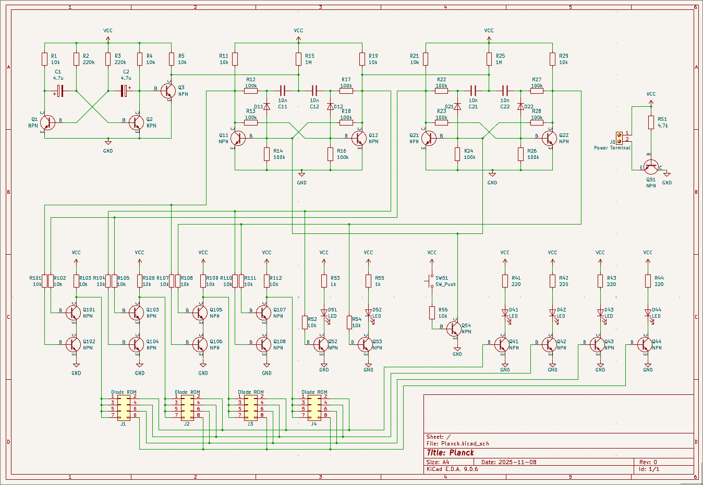

## Planck - My tiny programmable blinking LED circuit

My autism decided to get into homebrew computing, but i didnt know where to start with actual circuits.  
So I decided to go as simple as possible while keeping it pretty.  
This idea lead to this project and its future comings.  
The plan was to make a series of projects to slowly expand on making small "computer" systems with simple building blocks.  
For this first project those building blocks was just discrete components.  

The circuit is made from a simple clock running at about 1Hz feeding into two D-Flipflops acting as a 2-bit counter.  
This 2-bit output is fed into a multiplexer circuit which then provides power to the corresponding 4-bit diode-matrix ROM.  
The ROM is programmed by inserting diodes in specific positions to create the desired LED blink pattern.  
All in all, a splendid little passion project of mine.  

# Goals
Make a simple system using discrete components to program an LED blink sequence.  
Build it up on a PCB of some kind to hang on my wall for pretty kinetic art.  

# Status
Circuit - Finished  
PCB - Finished example (May make a better one eventually)  
Physical build - No (Only done on breadboard during design phase)  

# Schematic

# Components
It is possible i miscounted, but im pretty sure i got it right  
|**Component**|**Value**|**Quantity**|**Notes**|
|:---|:---|:---|:---|
|**Resistors**|`220`|4||
||`1k`|2||
||`4.7k`|1||
||`10k`|22||
||`100k`|12||
||`1M`|2||
|**Capacitors**|`10n`|4||
||`4.7u`|2|I used polarized but not strictly needed|
|**Transistors**|`NPN`|23|2n2222 worked just fine|
|**Diodes**|`Diode`|4+16|16 for the diode ROM|
||`LED`|6|I used 2 green for address and 4 red for output|
|**Connectors**|`2x4`|4|This is where the diodes are used to program the ROM|
